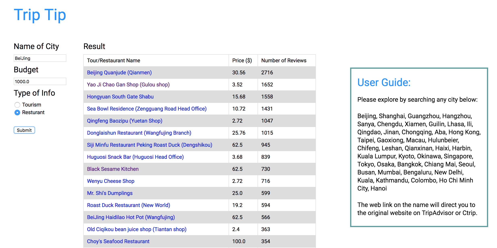

#Trip Tip
## Prerequisite:

flask, flask_restul need to be installed
## How to use it:

1. Run `main.py`
2. Open the browser
3. Use address: http://127.0.0.1:5000/trip    

You will see a web page like this:   

